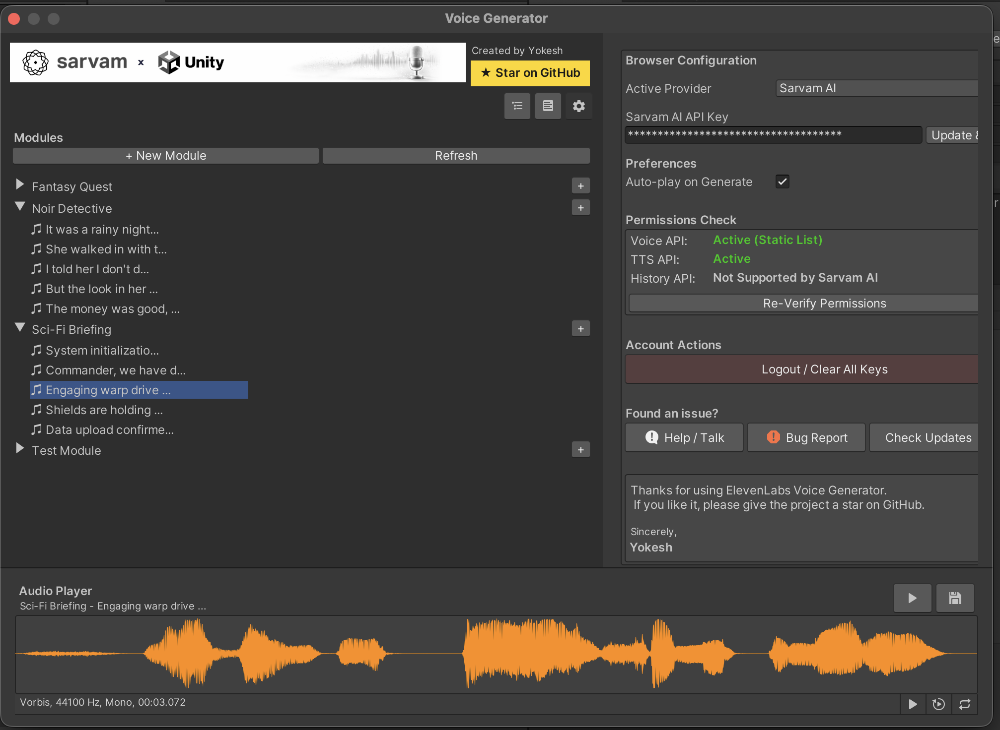

<div align="center">

# Unity AI Voice Over Plugin


</div>




> [!TIP]
> **Multi-Provider Support: Voiceover & Sarvam AI**
> This plugin integrates industry-leading APIs for lifelike speech synthesis.
>
> | **English & Global** | **Specialized Indic (Hindi, etc.)** |
> | :---: | :---: |
> |  |  |
> | [**IIElevenLabs**](https://elevenlabs.io/) | [**Sarvam AI**](https://www.sarvam.ai/) |

A powerful Unity Editor plugin that provides a seamless **Voice Over** workflow directly within your project. Integrate high-quality AI speech from providers like **Voiceover** and **Sarvam AI**, manage voice lines in modular steps, and streamline your audio pipeline without leaving the Unity Editor.

## 🗺️ Roadmap & Features

We aim to provide a comprehensive voice-over solution for Unity.

| Feature | Description | Status | Provider |
| :--- | :--- | :--- | :--- |
| **Multi-Provider Support** | Toggle between ElevenLabs and Sarvam AI seamlessly. | ✅ **Implemented** | All |
| **Text-to-Speech (TTS)** | Generate lifelike speech from text using standard models. | ✅ **Implemented** | All |
| **Voice Selection** | Browse and select voices from your provider library. | ✅ **Implemented** | All |
| **Batch Generation** | Generate audio for multiple lines/steps at once. | ✅ **Implemented** | All |
| **Voice History** | View and retrieve past generations. | ✅ **Implemented** | Voiceover |
| **ZIP Export** | Export generated audio as a ZIP archive. | ✅ **Implemented** | All |
| **Speech-to-Speech** | Transform input audio into a different voice. | 🚧 **Planned** | Voiceover |
| **Multilingual Voice Over** | Generate voiceovers in multiple languages of the user's choice. | 🚧 **Planned** | All |
| **Sound Effects (SFX)** | Generate sound effects from text descriptions. | 🚧 **Planned** | Voiceover |
| **Runtime API** | Generate voiceovers dynamically in a built game. | 🚧 **Planned** | All |
| **Timeline Integration** | Native integration with Unity's Timeline for cutscenes. | ⏳ **Backlog** | All |
| **Lip-Sync (Viseme) Generation** | Auto-generate blendshape data alongside audio for character speaking animations. | ⏳ **Backlog** | All |
| **Local / Offline TTS** | Support for local models (e.g., Piper, Coqui) for fully offline generation. | ⏳ **Backlog** | Local |
| **Narrative Tools Integration** | Importers for Yarn Spinner, Ink, and Dialogue System for Unity. | ⏳ **Backlog** | All |

> **Legend**: ✅ Implemented | 🚧 Planned (Next Up) | ⏳ Backlog (Later)

## 📥 Download

You can download the latest `.unitypackage` directly from our releases:

<a href="https://github.com/Yokesh-4040/Unity-VoiceOver-Plugin/releases/download/v1.0.5/VoiceOver-1.0.5.unitypackage">
  
</a>

## 📜 Changelog

**v1.0.5 - Initial Release**
- Multi-Provider Support (Voiceover & Sarvam AI).
- Text-to-Speech (TTS) generation and module management.
- Real-time Audio Playback Architecture and UI updates.

*See the full [Changelog](Assets/Voiceover/CHANGELOG.md) for a complete history of updates.*

## �📦 Installation

1.  **Clone the Repository**:
    ```bash
    git clone https://github.com/Yokesh-4040/Voiceover-Unity-Plugin.git
    ```
2.  **Copy to Project**:
    *   Copy the `Assets/Voiceover` folder into your Unity project's `Assets` directory.
    *   *(Note: The folder name will be updated to 'VoiceOver' in future versions, for now it remains 'Voiceover' for compatibility).*

## 🚀 Usage

1.  **Open the Window**:
    *   Go to `Window > Voice Over` in the Unity Editor menu (or press `Cmd+Opt+V` / `Ctrl+Alt+V`).
2.  **Provider Setup**:
    *   Navigate to the **Settings** tab.
    *   Choose your **Active Provider** (Voiceover or Sarvam AI).
    *   Enter your respective API Key.
3.  **Create a Module**:
    *   Click `+ New Module` in the sidebar.
    *   Give it a name (e.g., "IntroDialogue").
    *   Select a Default Voice for the module.
4.  **Add Steps**:
    *   Click the `+` button next to the module name to add voice steps.
    *   Select a step, enter your text, and click **Generate Audio**.
5.  **Save & Use**:
    *   Once satisfied, the audio clip is automatically saved to `Assets/Voiceover/Generated/[ModuleName]`.
    *   You can now use these `AudioClip` references in your game scripts!

## 🎵 Audio Playback Architecture

The plugin features a robust audio playback system with real-time UI updates and consistent state management across all audio sources.


**Key Components:**

1. **Audio Sources** - Four entry points for audio playback:
   - History Tab (Voiceover) - Load previously generated audio
   - Voice Modules (Select) - Auto-play when selecting steps
   - Voice Modules (Generate) - Auto-play after generation
   - Bottom Player UI - Manual playback controls

2. **Centralized Playback** - All sources route through a unified playback bridge:
   - Stops current audio
   - Updates player state
   - Creates waveform editor
   - Triggers UI update

3. **Real-time Updates** - UI reflects playback state automatically:
   - Continuously checks if audio is playing
   - Updates play/pause button icon in real-time

### Technical Details

- **Multi-Provider Bridge**: Abstracted API calls to support both ElevenLabs and Sarvam AI.
- **Unity AudioUtil Integration**: Uses reflection to access Unity's internal audio preview system.
- **Error Handling**: Comprehensive try-catch blocks prevent crashes.
- **Performance**: Minimal overhead with smart repaint logic.

## 🤝 Contribution

We welcome contributions from the community! Whether it's a bug fix, new provider integration, or documentation improvement, your help is appreciated.

### Guidelines
*   Please follow the existing code style (C# standards).
*   Ensure your code compiles without errors in the latest Unity LTS.
*   Namespace all new scripts under `FF.Voiceover` (Legacy) or appropriate sub-namespaces.

## ⭐ Support the Project

If you find this plugin useful for your projects, please consider **giving it a Star** ⭐️ on GitHub! It helps more developers find the tool and motivates us to add more features.

---
*This project is an independent tool and is not officially affiliated with Voiceover or Sarvam AI.*
